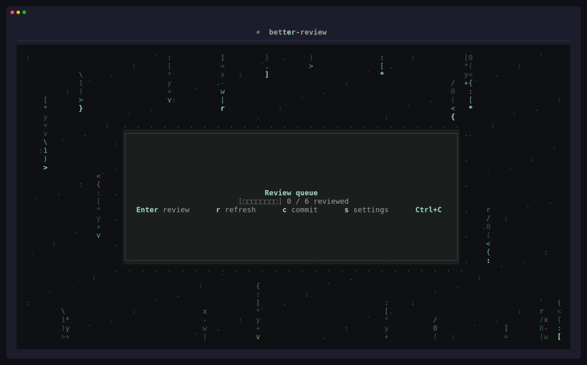

<div align="center">



Review agent changes, accept only what belongs, commit, and optionally publish.

# better-review

**A review-first terminal UI for code changes before they become commits.**

`better-review` gives you a focused fullscreen review surface for the current git worktree. It is especially useful after running a coding agent, but it also works for any local changes you want to inspect, stage deliberately, and commit with confidence.

[Installation](#installation) • [Quick Start](#quick-start) • [Explain](#explain-optional) • [Contributing](#contributing)

</div>

---

## What it does

- Shows the current repository diff in a dedicated TUI
- Lets you review by file or hunk
- Stages only the changes you accept
- Keeps rejected changes in your worktree instead of discarding them
- Lets you commit accepted changes from inside the app
- Optionally explains the current file or hunk using local `opencode` session context

`better-review` does not run your coding agent for you. It sits between code generation and git history.

## Features

- Review-first workflow for agent-generated or hand-written changes
- File-level and hunk-level accept/reject decisions
- Accepted-only commit flow
- Safe behavior in dirty repositories and partially staged states
- Optional `Explain` panel backed by local `opencode` sessions
- Session-local Explain history, retry, cancel, and model selection
- Configurable single-letter keybindings with duplicate prevention
- Optional GitHub publish prompt after committing reviewed changes
- Prebuilt release binaries for Linux and macOS

## Installation

### Prebuilt binary

Install the latest release:

```bash
curl -fsSL https://raw.githubusercontent.com/SalzDevs/better-review/main/install.sh | sh
```

Install a specific release:

```bash
BETTER_REVIEW_VERSION=v0.1.0 curl -fsSL https://raw.githubusercontent.com/SalzDevs/better-review/main/install.sh | sh
```

Supported prebuilt targets:

- Linux `x86_64`
- macOS `x86_64`
- macOS `arm64`

Useful installer variables:

- `BETTER_REVIEW_VERSION`: release tag to install, default `latest`
- `BETTER_REVIEW_REPO`: alternate `owner/repo`, useful for forks
- `BETTER_REVIEW_BIN_DIR`: exact destination directory for the binary
- `BETTER_REVIEW_INSTALL_PREFIX`: installs to `<prefix>/bin` when `BETTER_REVIEW_BIN_DIR` is unset

### Build from source

Requirements:

- Rust stable
- Git

Run from source:

```bash
cargo run
```

Build a release binary:

```bash
cargo build --release
```

Install locally with Cargo:

```bash
cargo install --path .
```

## Quick Start

1. Make changes in a git repository with your editor or coding agent.
2. Start `better-review` from that repository root.
3. Press `Enter` to open the review screen.
4. Accept or reject files and hunks.
5. Press `c` to commit the accepted changes.

Run the installed binary:

```bash
better-review
```

If you launch the app before changes exist, or if new changes arrive after the app starts, press `r` to refresh the latest worktree state.

## Review Model

`better-review` treats the git index as the source of commit eligibility.

- `y` accepts the current file or hunk and stages it
- `x` rejects the current file or hunk by removing it from the index while leaving the worktree change in place
- `u` moves the current file back to an unreviewed state by unstaging it
- `c` opens the commit prompt for the currently accepted staged changes

If the repository already had staged changes when `better-review` opened, the app will block committing from inside the TUI. That guard exists to avoid mixing unrelated staged work into the commit you are reviewing.

## Publish to GitHub

After a successful commit, `better-review` can push the reviewed commit from the current branch.

- Add a GitHub token in Settings if your remote uses HTTPS authentication
- The token is hidden in the UI and stored in the local `better-review` settings file
- Publishing uses `git push` with terminal prompts disabled, so missing or invalid credentials fail with an explanation instead of hanging the TUI
- If the branch has no upstream, publishing pushes to `origin/<current-branch>` and sets the upstream

Use a fine-grained GitHub token with repository Contents read/write access.

## Settings

Press `s` to open Settings. From there you can choose a UI theme, set the persistent default Explain model, save a GitHub token, or change single-letter keybindings.

Available themes:

- Default
- One Dark Pro
- Dracula
- Tokyo Night
- Night Owl

## Explain (optional)

`Explain` is available when local `opencode` is installed and the repository has local `opencode` session history.

Current behavior:

- `better-review` automatically picks the most recently updated local `opencode` session for the current repository when one exists
- Press `s` to open Settings and change the persistent default Explain model
- Press `o` in the Explain menu to choose a different context source
- Press `e` to open the Explain menu
- Explain scope follows review focus:
  - file focus explains the current file
  - hunk focus explains the current hunk
- Press `m` to choose a model or keep `Auto` for the current session
- Press `h` to open Explain history for the current `better-review` session
- Press `t` to retry the current explanation
- Press `z` to cancel a running explanation

Implementation details that matter to users:

- Explain runs against a forked `opencode` session, so the source coding session stays clean
- `Auto` uses the saved default model when one is configured, otherwise it falls back to the current session model when available
- Explain history is local to the current `better-review` session

If `opencode` is unavailable, the rest of `better-review` still works normally.

## Keybindings

| Key | Action |
| --- | --- |
| `Enter` | Enter review from home, or drill into hunks |
| `Esc` | Go back, close a modal, or return to home |
| `j` / `k` or arrows | Move through files, hunks, or menus |
| `Tab` | Cycle hunks in the current file |
| `r` | Refresh review changes from the worktree |
| `y` | Accept current file or hunk |
| `x` | Reject current file or hunk |
| `u` | Move current file back to unreviewed |
| `c` | Open commit prompt |
| `s` | Open settings |
| `e` | Open the Explain menu |
| `o` | Choose Explain context source from Explain menu |
| `m` | Choose Explain model for the current session |
| `h` | Open Explain history |
| `t` | Retry the current Explain run |
| `z` | Cancel the current Explain run |
| `Ctrl+C` | Quit |

Single-letter command keybindings can be changed from Settings. Each letter can be assigned to only one command.

## Repository Support

The current implementation is tested against these repository states:

- empty repositories
- dirty repositories
- preexisting staged changes
- partially staged files
- detached `HEAD`
- linked worktrees
- rename detection in diffs
- file mode-only changes
- pre-commit hook failures
- commit failures caused by merge conflicts

Current limitations:

- submodules are not a first-class review surface
- sparse checkout and unusual index/worktree setups are not explicitly supported
- binary, rename, and copy diffs are recognized, but their UI treatment is still basic

## FAQ

### Does this replace git?

No. `better-review` is a review and commit-gating interface on top of your existing git workflow.

### Does rejecting a change discard it from my worktree?

No. Rejecting removes the change from the index so it is no longer commit-eligible in the current review flow. Your worktree change stays in place.

### Do I need `opencode` to use this?

No. `opencode` is only needed for `Explain`.

### Is this only for agent-generated code?

No. The product is optimized for agent workflows, but it works for any local git changes.

## Contributing

Contributions that improve the review flow, git correctness, or Explain reliability are welcome.

### Local setup

```bash
git clone <your-fork-or-this-repo>
cd better-review
cargo run
```

### Before opening a pull request

Run the same core checks that CI expects:

```bash
cargo fmt --all --check
cargo clippy --all-targets --all-features -- -D warnings
cargo test --locked --all-targets -- --nocapture
```

CI also enforces line coverage floors, including stricter thresholds for critical modules.

### Project layout

- `src/app.rs`: TUI event loop, screens, overlays, and rendering
- `src/services/git.rs`: git integration, staging, hunk syncing, commit behavior
- `src/services/opencode.rs`: Explain integration and `opencode` session handling
- `src/services/parser.rs`: git diff parsing
- `src/domain/`: core diff and review data structures
- `src/ui/styles.rs`: shared visual styles for the TUI

### Docs and tests

If you change user-visible behavior, update the README and the relevant tests in the same pull request.
